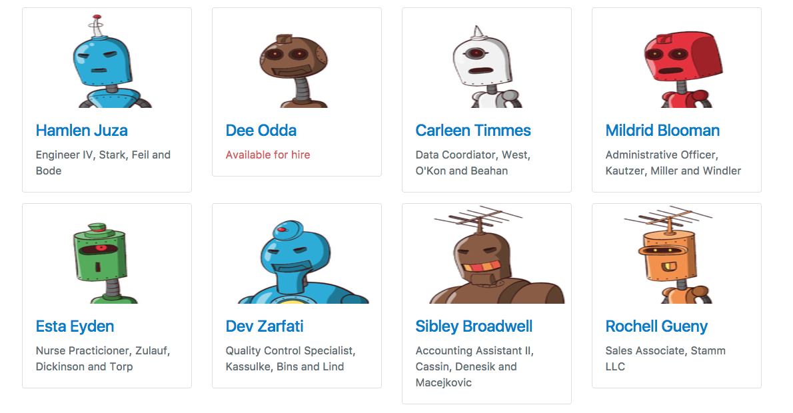

# Create a User Directory

From [The Iron Yard](https://newline.theironyard.com/cohorts/15/courses/10/projects/75)

## To-Do
- [ ] 1. Add code so that the url is displayed on the page; either with innerHTML and/or using window.location.href. See the [Node JS Tutorial for Beginners #25 - Template Engines](https://www.youtube.com/watch?v=oZGmHNZv7Sc) YouTube video to accomplish that. **Use a unique branch for this.**
- [ ] 2. Come back to identify what is the model, what is the view, and what is the controllor.
- [ ] 3. Make the style look like the mockup. **Use a unique branch for this.**
  - [ ] 3a. The "Available for hire" needs to be in red.
  - [ ] 3b. The way the skills are listed do not match the way they're listed in the mockup.
  - [ ] 3c. The mobile version of the profile page doesn't match the mockup. make the mobile version match the mockup. Among the changes that are needed are the font size. 
  - [ ] 3d. The mobile version of the home page doesn't exist. Make the mobile version of the home page.mustache, and the /views/profile.mustache files.
- [ ] 4. Clean up the comments and unneeded code. **Use the cleanup branch for this.** It has not yet been created.
- [ ] 5. Clean up the /public/css/style.css file. **Use the cleanup branch for this.** It has not yet been created.
- [ ] 6. Remove the /public/css/copy_style.css, /views/copy_profile.mustache, /views/copy_profile_available. **Use the cleanup branch for this.** It has not yet been created.
- [X] 7. Remove the 'old' directory.
- [ ] 8. Update gh-pages.

## Create a user directory
Given a file of user data, create a directory of users.

Using the attached data.js file, build an Express app that works as a directory of users in the file. You should use require to get the data from the data.js file.

The amount of info each user has varies. Users with no job or company data are currently looking for work."

Your directory should look like the following images. Your CSS should be in a file in the /public/ directory and be served through Express.

Index

A user with all their data

A user looking for work

A user missing educational and city data

---
**Note:** following the instructions in the [How to Run a Simple HTML/CSS/Javascript Application on Heroku](https://medium.com/@winnieliang/how-to-run-a-simple-html-css-javascript-application-on-heroku-4e664c541b0b) article I created the composer.json and the index.php files for the sole purpose of being able to deploy this to Heroku.

### To use this repo
In Terminal in the root directory run `npm install`.
Then run `nodemon main.js`.
